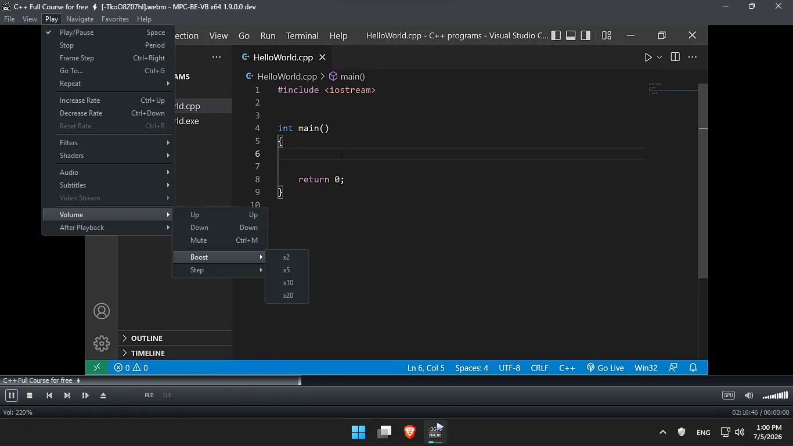
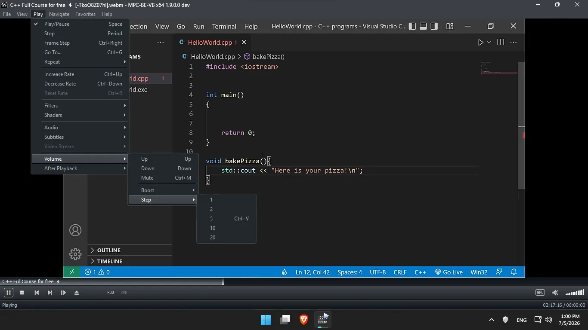
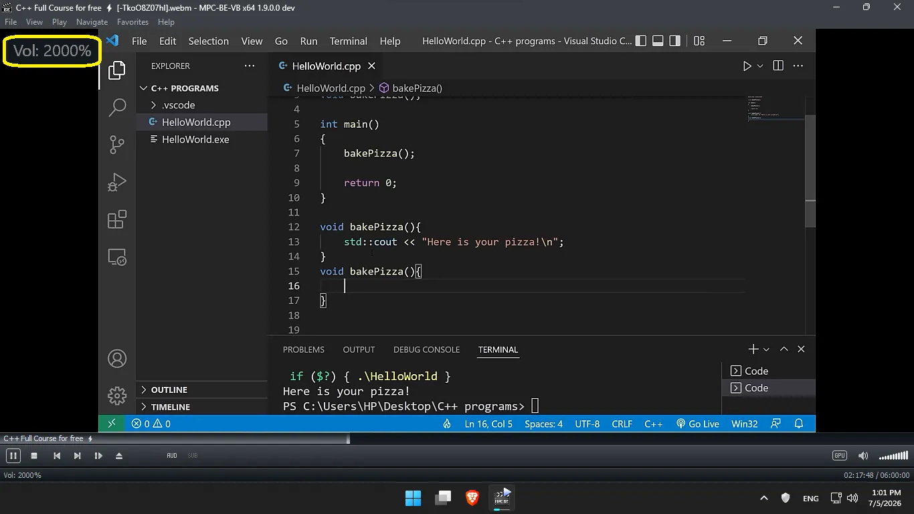

# MPC-BE-VB — Media Player Classic with Volume Boost

MPC-BE-VB is a fork of [MPC-BE](https://github.com/Aleksoid1978/MPC-BE) (Media Player Classic - Black Edition) that extends the volume range from 100% to **1000%** (10x) by default, with configurable ceiling and precise manual step control in Audio options.

## What's different from upstream MPC-BE

- **Volume range 0–1000%** instead of 0–100% (configurable ceiling 1x–10x via boost slider in Audio options)
- **Manual volume step control**: set an exact step size in percent or use the Boost/Step preset submenus under Play > Volume (previously adjustable step size 1–20 slider positions per click; retains compatibility)
- **Mouse wheel over the volume slider** boosts up to the configured ceiling
- **Visual bar stays at full width** for values above 100% (clean UI)
- **Audio renderer handles boost** via the same logarithmic volume curve (`dB = 2000 * log10(v/100)`) — extended to support the higher ceiling
- **Registry, command-line, Web UI, LCD** — all interfaces support the full range
- **LTCG removed** from common.props to fix soxr heap corruption on rebuild
- **Auto-update disabled** — no startup check, no menu item, no background poll

## System requirements
* An SSE2 capable CPU
* Video card supporting DirectX9.0c (PS 3.0)
* Windows 7, 8, 8.1, 10, 11 32-bit/64-bit

## Downloads
- [Releases](https://github.com/youcef07dz/MPC-BE-VB/releases)
- [Get code](https://github.com/youcef07dz/MPC-BE-VB.git)

## CI Builds
Pushing a tag `v*` triggers [GitHub Actions](.github/workflows/build.yml) to:
- Build x86 and x64 Release binaries (mpc-be, mpciconlib, MPCBEShellExt)
- Create Inno Setup installers for both platforms
- Publish installers as downloadable release assets

## Screenshots

| | |
|---|---|
|  |  |
|  | |

---
 
For the people involved in the development, see Authors.txt.
MPC-BE's code is licensed under GPL v3 (see LICENSE).

Translations are done by various translators (see Authors.txt).

---

MPC-BE makes use of the following 3rd party code:

| Project           | License             | Website                                               |
|-------------------|---------------------|-------------------------------------------------------|
| Bento4            | GPLv2               | https://www.bento4.com/                               |
| CFileVersionInfo  |                     |                                                       |
| CLineNumberEdit   |                     |                                                       |
| compact_enc_det   | Apache-2.0 license  | https://github.com/google/compact_enc_det             |
| coolsb            |                     | https://www.codeproject.com/KB/dialog/coolscroll.aspx |
| CSizingControlBar | GPLv2               | http://datamekanix.com/sizecbar/                      |
| Detours           | MIT License         | https://github.com/microsoft/detours/                 |
| fdk-aac           |                     | https://github.com/mstorsjo/fdk-aac/                  |
| FFmpeg            | GPLv3               | http://ffmpeg.org/                                    |
| dav1d             | BSD License         | https://code.videolan.org/videolan/dav1d/             |
| libdivide         | zlib/Boost License  | https://libdivide.com/                                |
| libflac           | GPLv2/BSD License   | https://github.com/xiph/flac                          |
| libpng            | zlib/libpng License | https://github.com/glennrp/libpng/                    |
| libspeex          | BSD License         | https://speex.org/                                    |
| Little CMS        | MIT License         | https://littlecms.com/                                |
| Logitech SDK      |                     |                                                       |
| MediaInfo         | BSD License         | https://mediaarea.net/MediaInfo                       |
| mfx_dispatch      | MIT License         | https://github.com/Intel-Media-SDK/MediaSDK           |
| RapidJSON         | MIT License         | https://github.com/Tencent/rapidjson                  |
| ResizableLib      | Artistic License    | https://github.com/ppescher/resizablelib              |
| soxr              | LGPL                | https://sourceforge.net/projects/soxr/                |
| TreePropSheet     |                     |                                                       |
| uavs3d            | BSD License         | https://github.com/uavs3/uavs3d                       |
| VirtualDub        | GPLv2               | https://virtualdub.org/                               |
| ZenLib            | zlib License        | https://github.com/MediaArea/ZenLib                   |
| zlib              | zlib License        | https://zlib.net/                                     |
| bs2b              | MIT License         | https://bs2b.sourceforge.net/                         |
| VVdeC             | BSD License         | https://github.com/fraunhoferhhi/vvdec/               |
